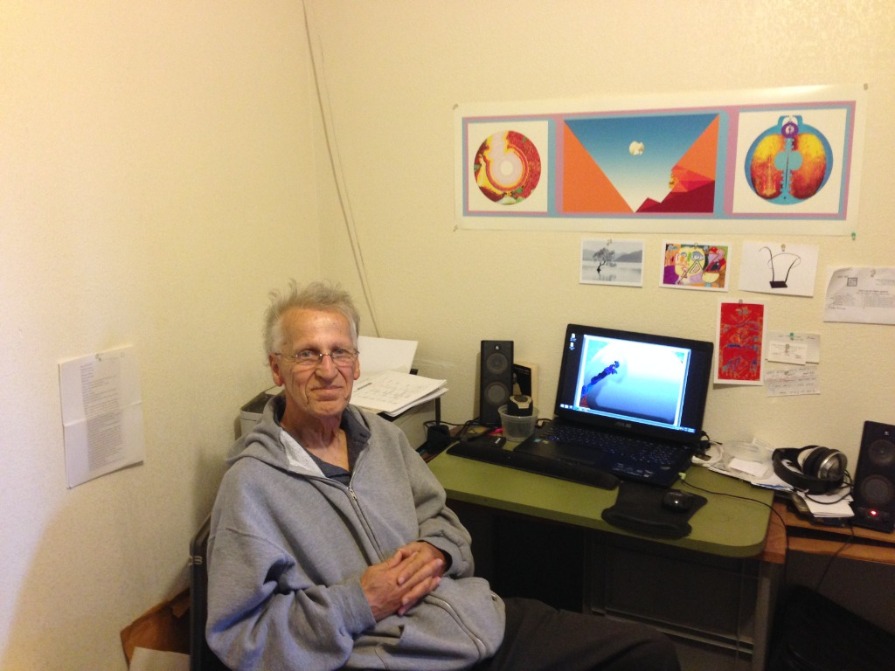
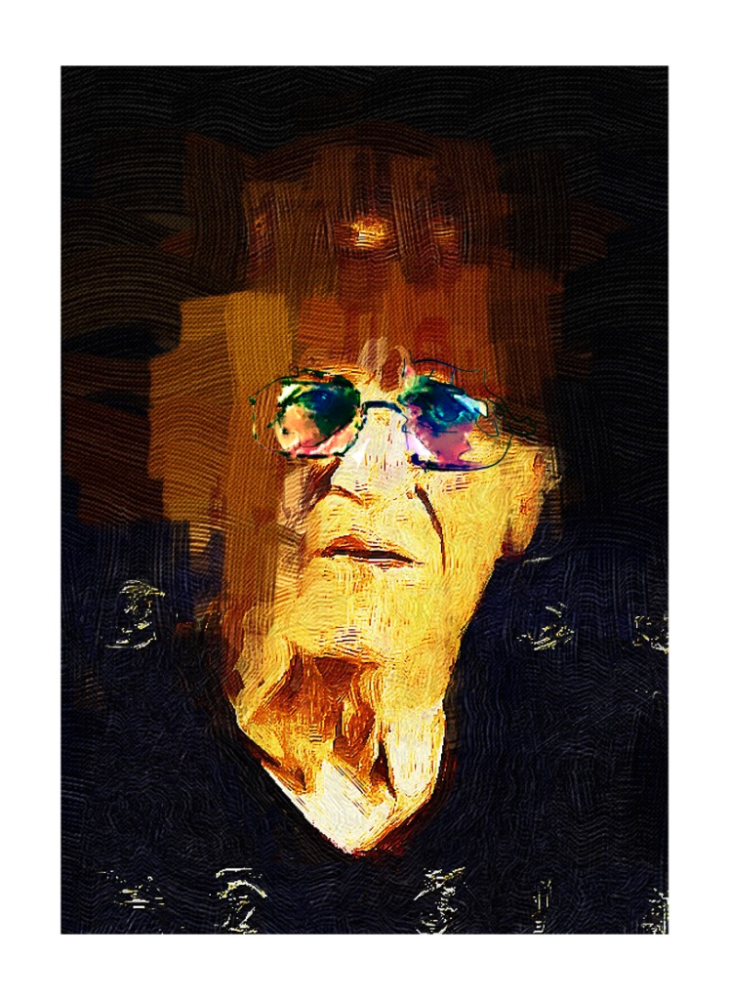
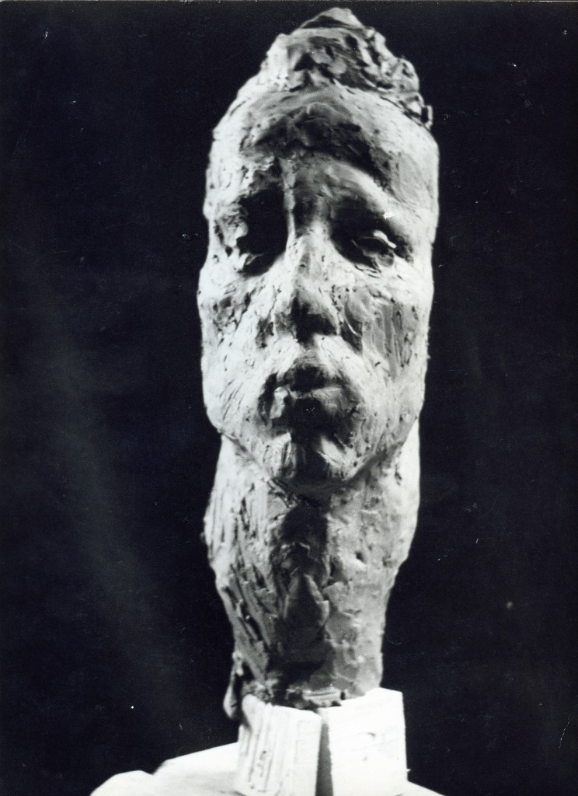

Peter Kubina (1927–2010) was an artist whose work spanned six decades, moving from early figurative sketches to the stark, textured abstractions for which he became best known. Born in the industrial heartland, his early exposure to machinery and structural forms deeply influenced his later obsession with the physical weight and presence of paint.

## A Life in Layers

While his artistic output was prolific, Kubina’s life was grounded in the everyday. To support his practice and his family, he drove a taxi for many years, navigating the city streets by day and retreating to his studio by night. He often completed artworks in his downtime, finding moments of creation in the spaces between fares. This duality—the noise of the city and the silence of the canvas—informed the rhythm of his work.

## The Quiet Observer

Kubina was a notoriously private individual, preferring the solitude of his studio to the gallery circuit. His works were often created in silence, a meditative process that he equated to prayer. Despite this reclusiveness, his work speaks with a loud, resonant clarity, inviting the viewer to pause and engage in the same act of contemplation that birthed the piece.

In his later years, Kubina was diagnosed with cancer. He continued to work through his illness, his compositions becoming simpler and more profound as his health declined. He eventually succumbed to the disease in 2010, leaving behind a vast and cohesive body of work.

This archive, curated by his family, seeks to preserve not just the final artworks, but the memory of the disciplined, quiet soul who created them.
